# storage-api

### Задание
1. Создать публичный GitHub репозиторий и залить туда свой Django проект.

2. Проект должен иметь заполненные файлы requirements.in, requirements.txt, .gitignore.

3. В проект должен быть интегрирован Django REST.

4. При помощи механизмов Django REST в проекте должен быть реализован следующий функционал:
   * Регистрация пользователя по имейлу и паролю с указанием типа поставщик, потребитель
   * Аутентификация пользователя
   * Создание склада
   * Создание товара
   * Поставщик должен иметь возможность поставлять товар на выбранный склад
   * Потребитель должен иметь возможность забирать товар со склада

5. Ограничения:
 * Потребитель не может поставлять товар
 * Поставщик не может получать товар
 * Потребитель не может получить товара больше, чем имеется на складе

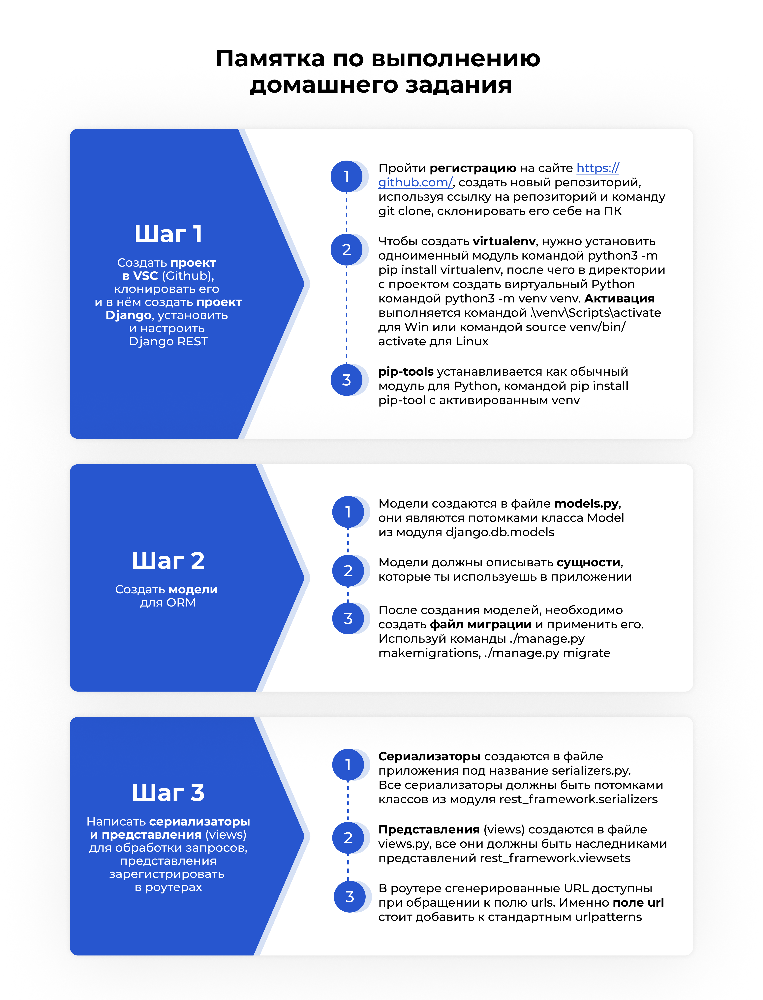

### Настройка окружения
Настройка окружения выполняется при помощи инструмента `uv`. Подробнее описал процесс настройки в [другом репозитории](https://github.com/selvnv/py-setup)

### Настройка Django проекта

* Предварительно нужно настроить виртуальное окружение и установить зависимости
* Инициализация Django проекта - генерирует файлы, необходимые для работы проекта на Django:
  * `django-admin startproject storage_api`
* Инициализация нового сервиса (модуля) проекта - генерирует файлы, которые могут использоваться отдельным модулем проекта (модели, представления, тесты и др.):
  * `py .\manage.py startapp api`
* Регистрация сервисов приложения - указание данных в `INSTALLED_APPS`, в файле проекта `settings.py`:
  * `rest_framework`
  * `api`
* Создание суперпользователя:
  * `py .\manage.py createsuperuser --username admin`
* Создание файла миграции при первичном запуске, а также после создания или изменения моделей:
  * `py .\manage.py makemigrations`
  * Файл миграции описывает - как применить изменения к базе данных, чтобы она соответствовала текущему описанию моделей
  * Без выполнения этой команды, новая структура моделей не будет применена к базе данных
* Применение изменений:
  * `py .\manage.py migrate`

### Запуск
* Создание файла миграции: `py .\manage.py makemigrations`
* Применение миграций: `py .\manage.py migrate`
* Выполнить команду из корневой директории проекта: `py .\manage.py runserver`

### Описание

####  Модели

* `UserRole` - роль пользователя
  * `id` - идентификатор экземпляра сущности UUIDv4
  * `name` - название роли (уникальное)
  * `description` - описание роли
  * `is_service` - флаг служебной роли
* `ApiUser` - пользователь (унаследован от `django.contrib.auth.models.AbstractUser`)
  * `id` - идентификатор экземпляра сущности UUIDv4
  * `roles`- роли назначенные на пользователя
    * Связь `ManyToMany` к `UserRole`
    * Каскадное удаление `True`
* `Storage` - склад
  * `id` - идентификатор экземпляра сущности UUIDv4
  * `name` - название склада
  * `address` - адрес склада
* `Item`
  * `id` - идентификатор экземпляра сущности UUIDv4
  * `name` - название товара
* `StorageItem` - сводная таблица
  * `storage` - внешний ключ к `Storage`
    * Каскадное удаление `True`
  * `item` - внешний ключ к `Item`
    * Каскадное удаление `True`
  * `quantity` - количество конкретного товара на конкретном складе

#### Эндпоинты

| Endpoint                 | Methods | Description                    | Content                                                                                                   | Requirements                   |
|--------------------------|---------|--------------------------------|-----------------------------------------------------------------------------------------------------------|--------------------------------|
| `/user_role/`            | `CRUD`  | Управление ролями              | <ul><li>`id` (read only, querystring)<li>`name`<li>`description`<li>`is_service`</ul>                     | `AdminOrReadOnlyPermission`    |
| `/user/`                 | `CRUD`  | Управление пользователями      | <ul><li>`id` (read only, querystring)<li>`username`<li>`email`<li>`roles`<li>`password` (write only)</ul> | `OwnerOrReadOnly`              |
| `/storage/`              | `CRUD`  | Управление складами            | <ul><li>`id` (read only, querystring)<li>`name`<li>`address`</ul>                                         | `ProviderOrReadOnlyPermission` |
| `/item/`                 | `CRUD`  | Управление товарами            | <ul><li>`id` (read only, querystring)<li>`name`</ul>                                                      | `ProviderOrReadOnlyPermission` |
| `/inventory/`            | `CRUD`  | Управление товарами на складах | <ul><li>`id` (read only, querystring)<li>`storage`<li>`item`<li>`quantity`</ul>                           | `ProviderOrReadOnlyPermission` |
| `/inventory/fetch_item/` | `POST`  | Получение товаров со складов   | <ul><li>`id` (read only, querystring)<li>`quantity`</ul>                                                  | `ConsumerOrReadOnlyPermission` |
| `/api-token-auth/`       | `POST`  | Получения токена пользователя  | <ul><li>`username`<li>`password`</ul>                                                                     | -                              |

### Примеры

#### Получение токена пользователя

#### Получение списка ролей

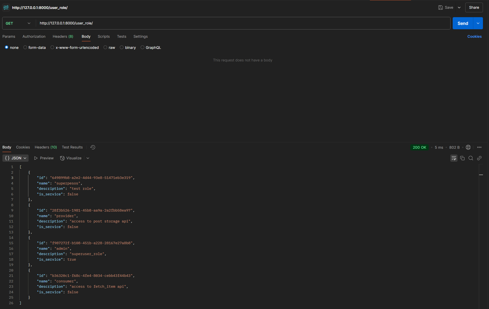

#### Создание роли

Предварительно нужно получить токен пользователя с правами администратора. Этот токен указывается в заголовке `Authorization` при выполнении запроса в формате `Token a9aac39a3017adc18b78dc2f9acb0d0ce1b4e8b0`

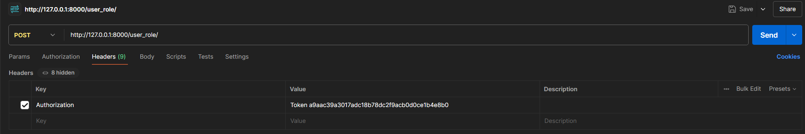

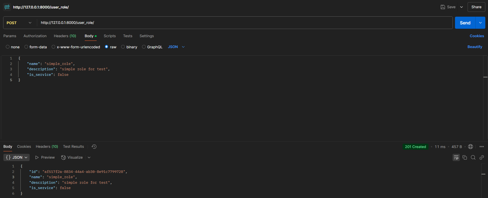

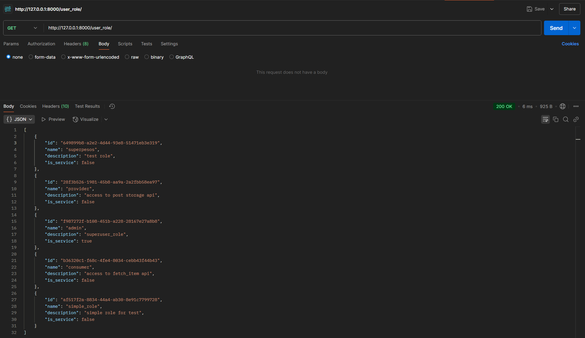

#### Получение списка пользователей

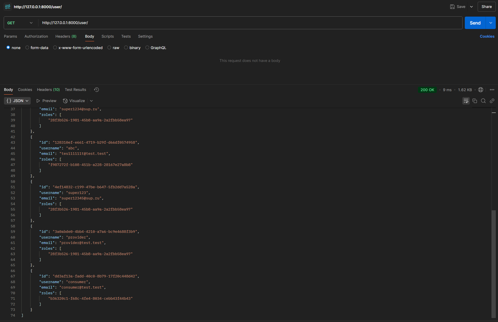

#### Создание пользователя

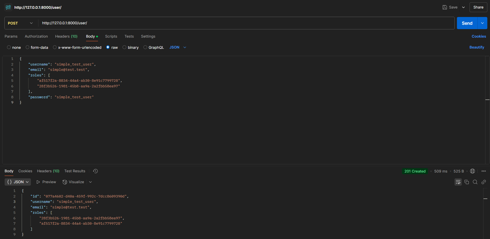

#### Обновление данных пользователя

Данные пользователя может менять только сам пользователь (предварительно получить токен пользователя и указать в соответствующем заголовке)

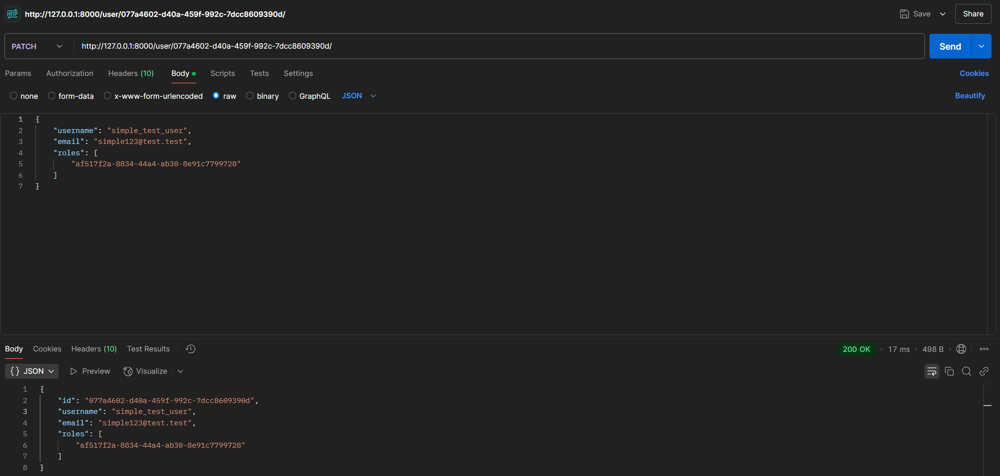

#### Получение списка складов

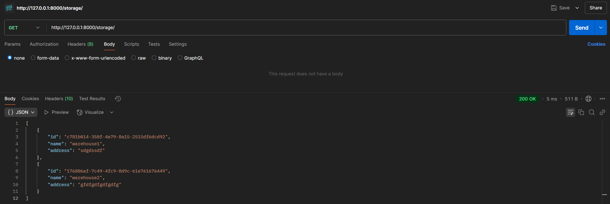

#### Создание склада

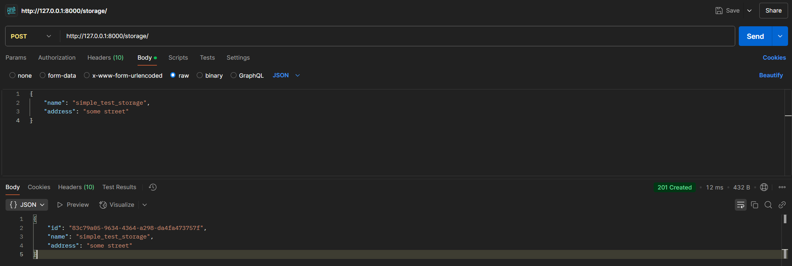

#### Получение списка товаров

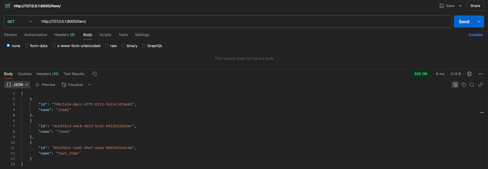

#### Создание товара

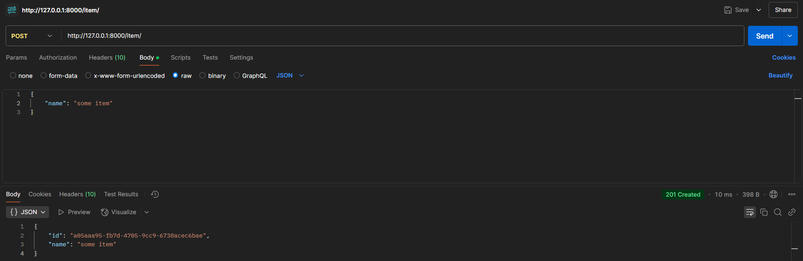

#### Получение содержимого складов

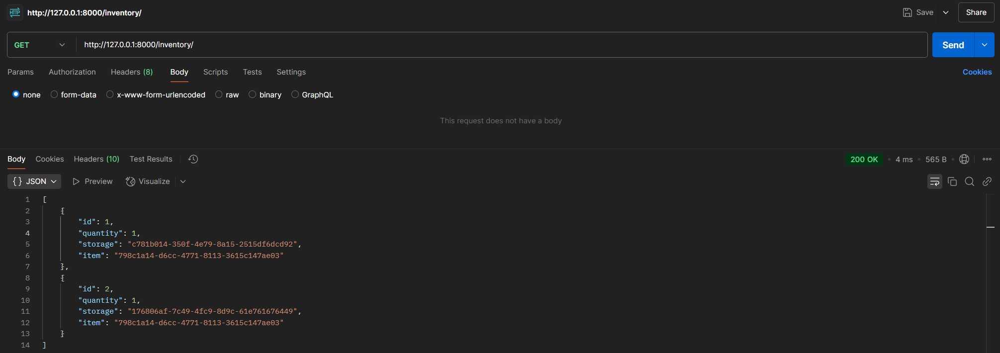

#### Добавление товаров на склад

Для выполнения небезопасных запросов требуется роль `provider`

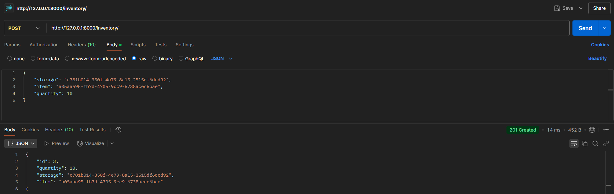

Повторно создать инвентарь с не уникальной связкой атрибутов `storage` и `item` нельзя

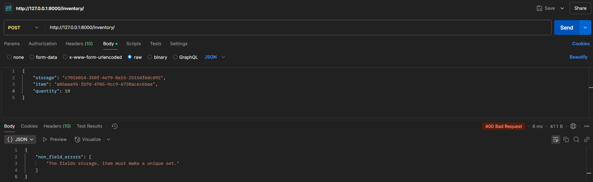

После создания нужно использовать метод обновления данных

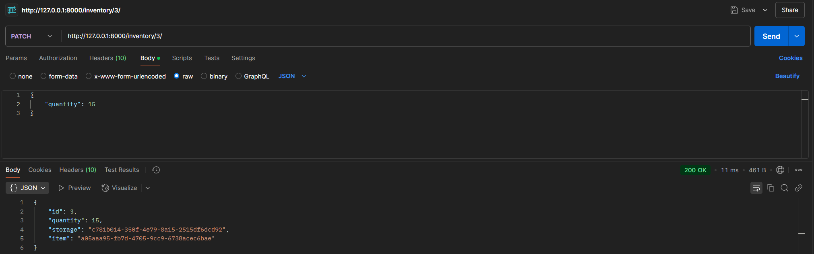

#### Получение товаров со склада

Для выполнения небезопасных запросов требуется роль `consumer`

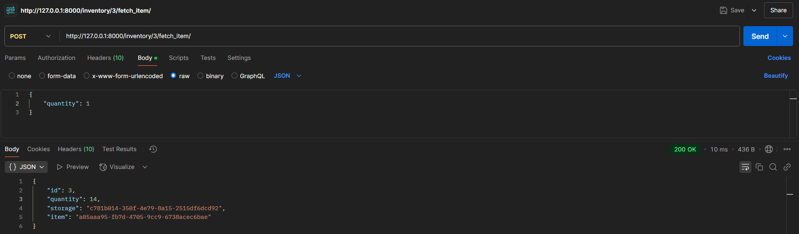
